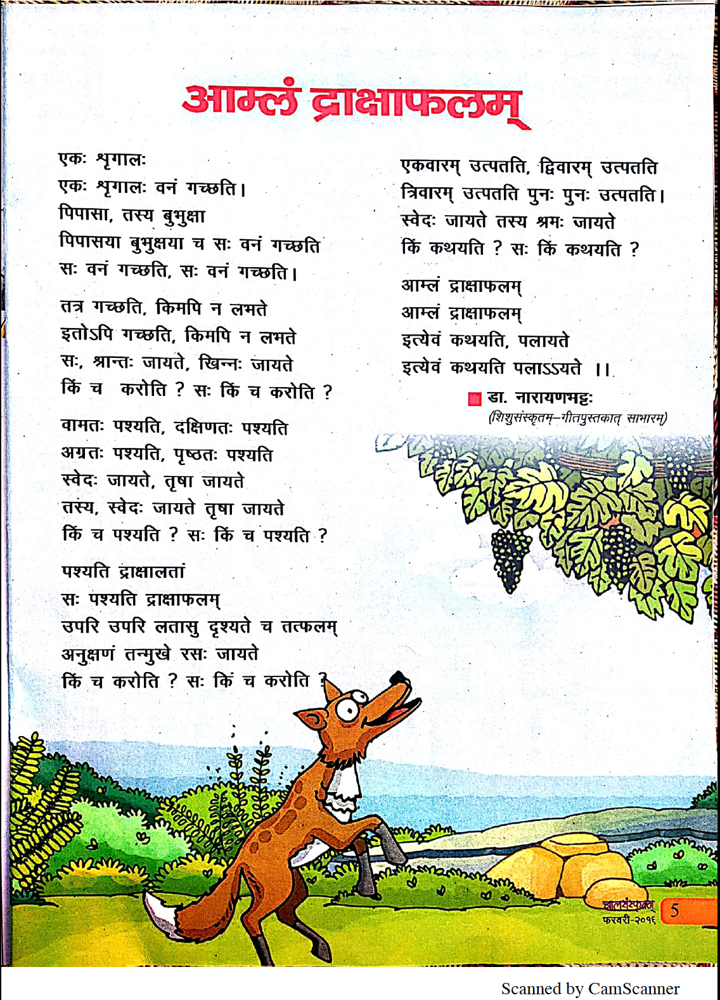

# Feb-06-2019

## विषयाः

### 8.1 - pg. 31 - उपस्थापनम्

* पुरतः
* पृष्ठतः
* वामतः
* दक्षिणतः
* अधः
* उपरि

### 8.2 अ - pg. 32 - अभ्यासः

### 8.2 आ - pg. 32 - अभ्यासः

### 8.2 इ - pg. 33 - उपस्थापनम् / अभ्यासः

* अन्तः
* बहिः

### 9.1 - pg. 33 - उपस्थापनम्

* इतः
* ततः
* कुतः
* इतस्ततः
* उपरिष्ठात्

### 9.2 - pg. 34 - अभ्यासः

## एकः शृगालः

