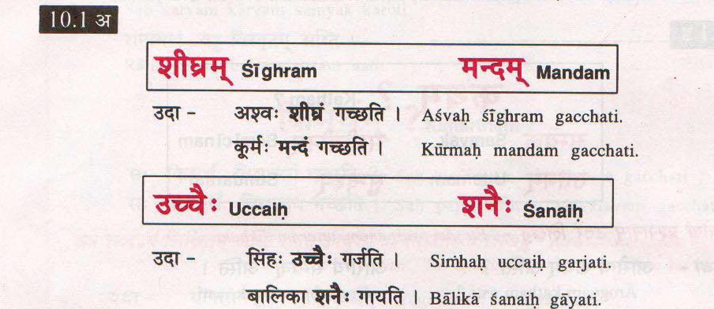
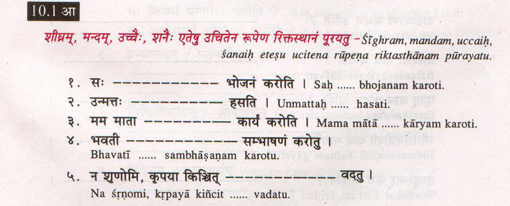
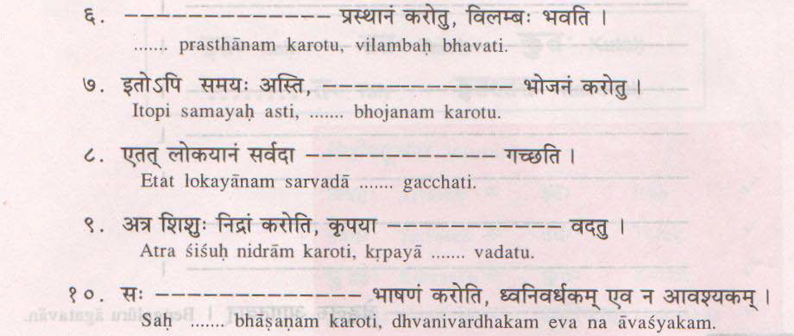
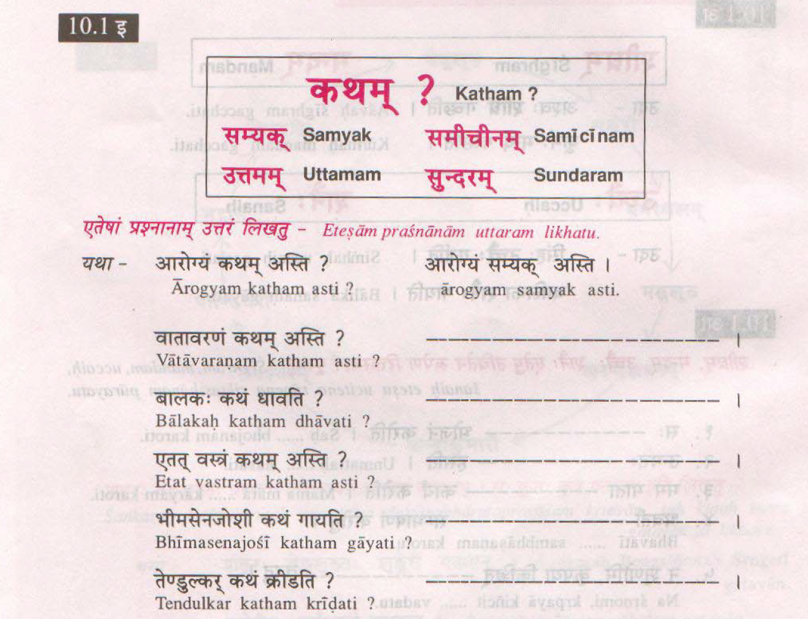
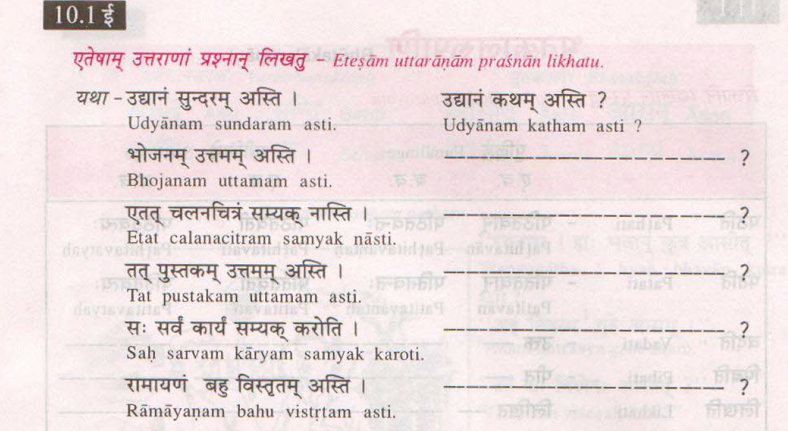
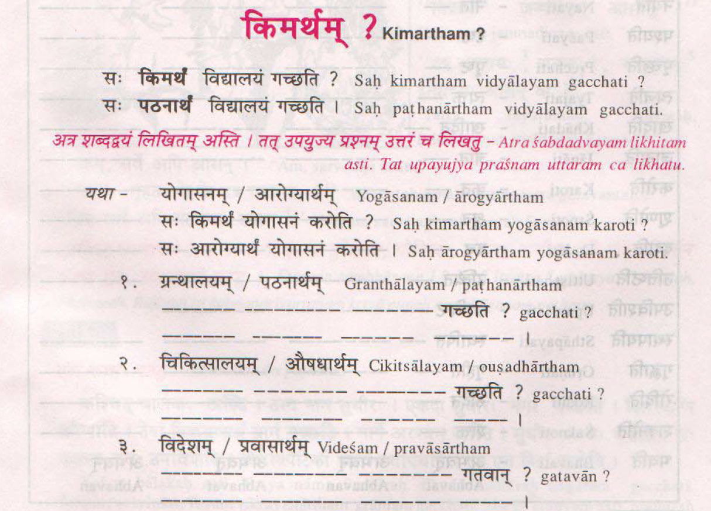

# Feb-13-2019


## विषयाः

* [प्रार्थना](/downloads/beginning and Ending prayer slokas.pdf)

## छात्राः

* सुनीता
* आभा
* अथर्वः
* शान्ती


## सुभाषितम्

```
पुस्तकस्तेषु या विद्या पर हस्तेषु यत् धनम् ।
कार्यकाले समायाते न सा विद्या नतत् धनम् ॥
```

### 10.1 - अ - pg. 35 - उपस्थापनम्

* शीघ्रम्
* मन्दम्
* उच्चैः
* शनैः




### 10.1 - आ - अभ्यासः




### 10.1 - इ - कथम् ?

* सम्यक्
* समीचीनम्
* उत्तमम्
* सुन्दरम्

#### समाधान वाक्यानि



#### प्रश्नार्थक वाक्यानि




### 10.1 - ई - किमर्थम्?



## 11.1


संस्कृते शब्दाः द्विविधाः

1. सुबन्ताः -> Nouns
1. तिङ्न्ताः -> Verbs


## कथा - चतुरः विक्रयिकः

[चतुरः विक्रयिकः - स चित्र कथा](/downloads/चतुरः विक्रयिकः.pdf)


