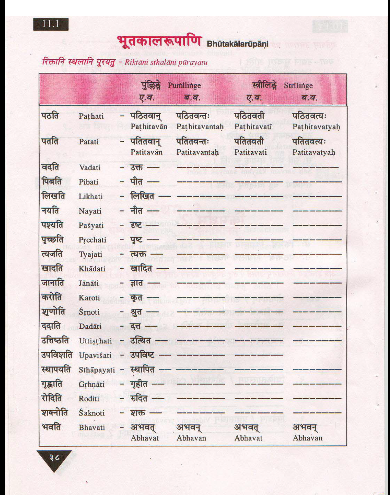
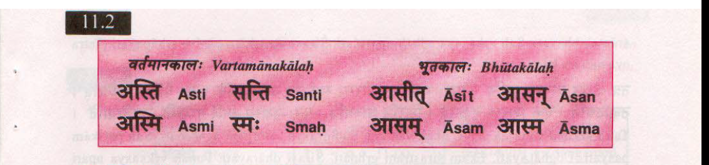
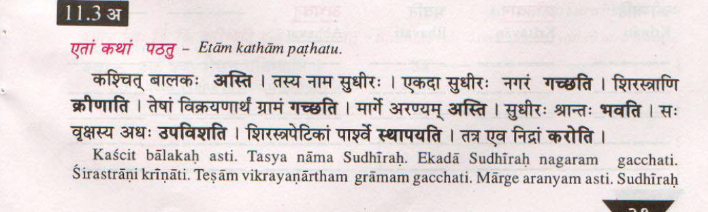
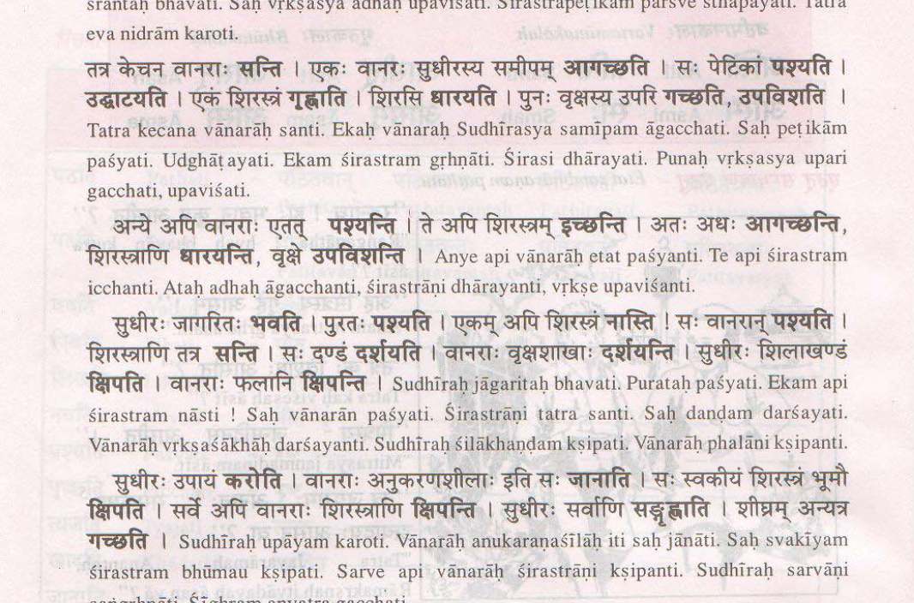
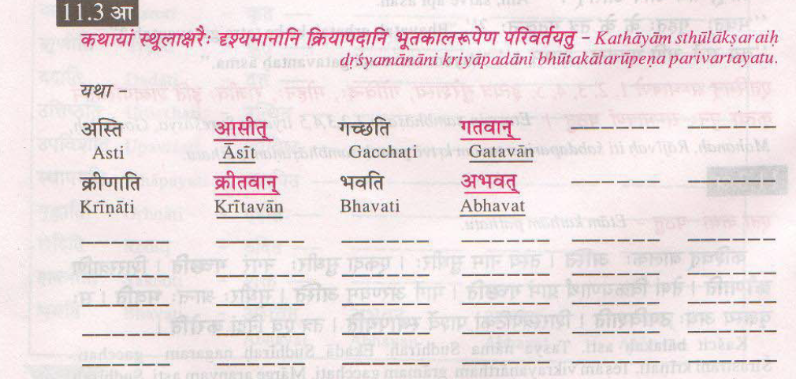
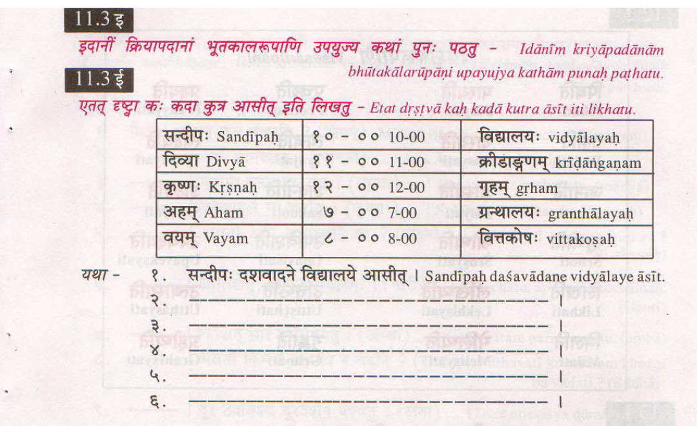

# Feb-20-2019

## विषयाः

* [प्रार्थना](/downloads/beginning and Ending prayer slokas.pdf)

## छात्राः

* सुनीता
* आभा
* अथर्वः
* शान्ती

## सुभाषितम्

## 11.1

संस्कृते शब्दाः द्विविधाः

1. सुबन्ताः -> Nouns
1. तिङ्न्ताः -> Verbs

## 11.2

## 11.3.a

[चतुरः विक्रयिकः - स चित्र कथा](/downloads/चतुरः विक्रयिकः.pdf)

## 11.3.aa

## 11.3.i

